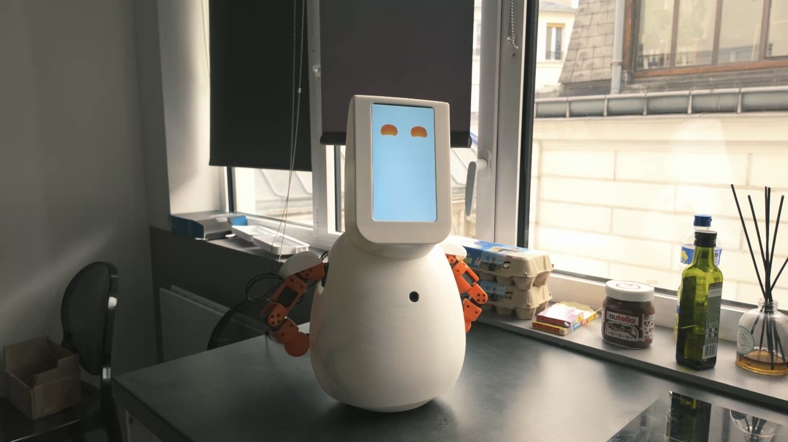
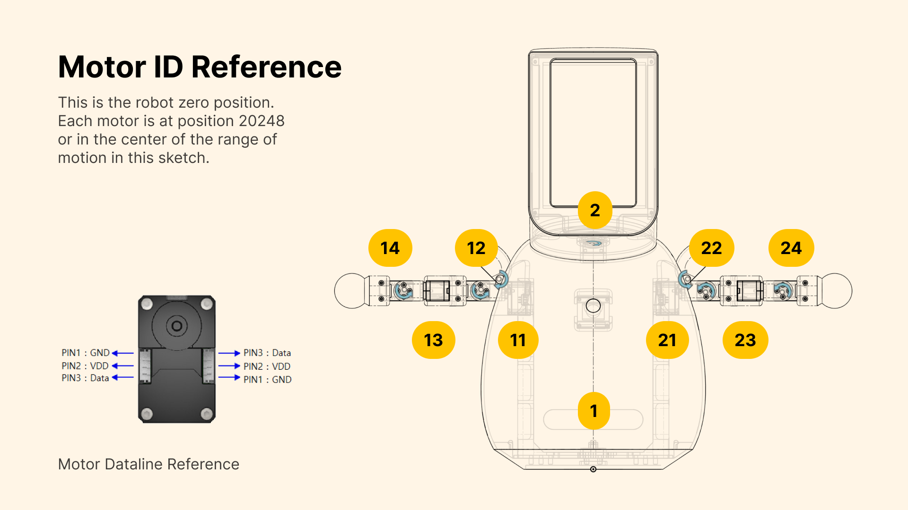
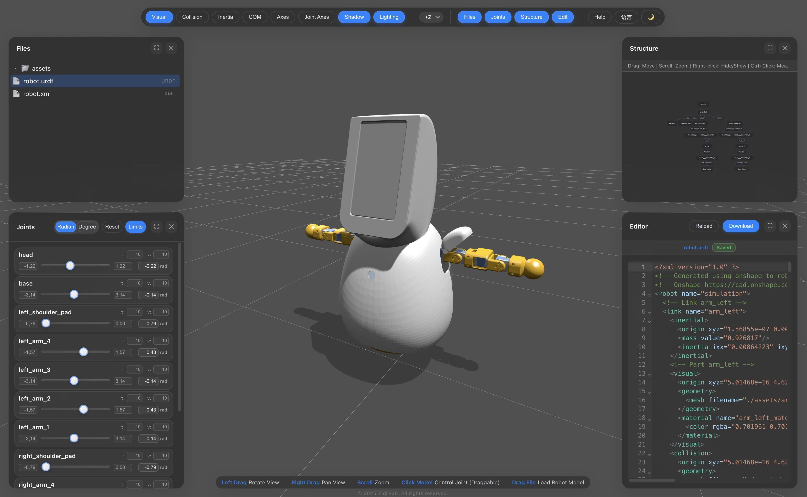

# Bebo Jr



I built Bebo Jr as a small, affordable half-humanoid to tinker with human–robot interaction and motion re-targeting. It's inspired by Jibo, Moxie, Reachy Mini and other similiar desktop robots.

This repository holds all the files necessary to build Bebo Jr, including print and simulation files. The repository which contains Bebo Jr's runtime will be released later, since I'm actively working on it to adapt to other robotics form factor.

In this repository, I also provided simple scripts for motion retargeting using Inverse Kinematics for Bebo Jr as reference code for other people when working with the simulation files of Bebo Jr.

## How to build Bebo Jr

### Bill of Materials

| Item                           | Qty | Link                                                                                          | Est. price |
| ------------------------------ | --- | --------------------------------------------------------------------------------------------- | ---------- |
| ~5                             |
| Raspberry Pi 5 (4GB)           | 1   | https://www.amazon.fr/-/en/Raspberry-4GB-Quad-Core-ARMA76-64-bit/dp/B0CK3L9WD3                | ~80        |
| Waveshare motor driver         | 1   | https://www.amazon.fr/dp/B0CJ6TP3TP                                                           | ~30        |
| XL330-M288T servo              | 10  | https://emanual.robotis.com/docs/en/dxl/x/xl330-m288/                                         | ~55 each   |
| 7\" HDMI display               | 1   | https://www.amazon.fr/dp/B0CLLHGX54                                                           | ~45        |
| ReSpeaker 2-Mic HAT for Pi     | 1   | —                                                                                             | ~18        |
| Innomaker 720p camera          | 1   | https://www.amazon.fr/-/en/InnoMaker-720P-Camera-DFOV-120%C2%B0/dp/B0CLRJZG8D                 | ~25        |
| 3W mini speaker (JST-PH2.0)    | 1   | https://www.amazon.fr/-/en/QUARKZMAN-JST-PH2-0-Interface-Electronic-Advertising/dp/B0DB1WM4QR | ~12        |
| 6704-2RS bearings (20x27x4 mm) | 2   | https://www.amazon.fr/-/en/sourcing-6704-2RS-Groove-Bearing-20mmx27mmx4mm/dp/B0834WBWGS       | ~8 each    |
| Thin micro-HDMI cable          | 1   | https://www.amazon.fr/dp/B0F1NFHK91                                                           | ~10        |
| M3 heat-set inserts            | 8   | —                                                                                             |

There are miscellaneous parts, such as wires, but they should be included when you buy the core components.

### Print the parts

All the `.3mf` files live in `print/`; I slice each once for a full set. My PLA baseline:

- Layers: 0.2 mm (0.16 mm for the head/screen mask)
- Shell: 3 perimeters; 4–5 solid top/bottom layers
- Infill: 20–30% gyroid or grid
- Temps: 0.4 mm nozzle at ~200–210 °C; bed 60 °C
- Supports: build-plate only for head shell and shoulders (tree/organic if available)
- Adhesion: brim on tall or narrow parts (arm segments, rotating base)
- Material: PLA is easiest; PETG works if I slow down and cool overhangs

The OnShape model can be used to reference on how build Bebo JR:
https://cad.onshape.com/documents/6693e038d6f5b2ee88eb0e81/w/837c8362b0b0bbf41939d6fd/e/ded7f450cb5bd722a96b42b6?renderMode=0&uiState=692619ba07daa5972ddaf705

### Zero Position and Motor ID



The zero position of Bebo Jr can be referenced from the above picture.

Prior to assembly, you should zero all motors and provide them with the ID shown above. Bebo Jr needs to be assembled so that in the above position, all motors should read zero, hence zero position. This reduces the amount of work necessary for calibration and sim-to-real when training policies on top of the robot.

## Simulation and Motion Retargeting



You can test the IK teleop without assembling anything by running the simulation and motion re-targeting code.

The files for simulation in other software can be found in `simulation`. The format included are URDF and Mujoco.

### Setting up

The repository uses uv for dependency management. To run the re-targeting, run the following commands.

```bash
# Install uv if you haven't
curl -LsSf https://astral.sh/uv/install.sh | sh

# Sync dependencies
uv sync

# Run camera to robot teleop script.
uv run teleop/4_camera_robot_ik.py
```

You’ll need a camera for body tracking. It's still a bit buggy since monocular depth estimation isn't reliable on most body tracking software, especially mediapipe.

### Stages

You can learn more about each stages of the re-targeting pipeline below:

- `uv run teleop/1_body_tracking_camera.py` — capture pose from the camera and publish normalized landmarks.
- `uv run teleop/2_inverse_kinematics.py` — sinusoidal wrist targets driving the simulated arms.
- `uv run teleop/3_camera_robot_overlay.py` — camera feed with overlaid targets.
- `uv run teleop/4_camera_robot_ik.py` — full motion re-target: MediaPipe wrists driving both arms via IK.

## License

This project is GPL-3.0-or-later. You’re free to use, modify, and share it as long as derivatives stay under GPL-compatible terms.
